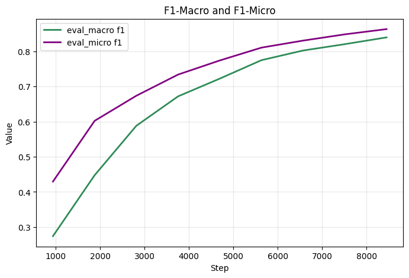

# Math-Classifier
## Description
Multilabel-Classifier DistilBERT model fine-tuned on Wikipedia math articles from [The Mathematics Portal
](https://en.wikipedia.org/wiki/Portal:Mathematics) which you can try on [Website](http://13.61.152.166:8000/)
## Dataset
[The Mathematics Portal](https://en.wikipedia.org/wiki/Portal:Mathematics) provides subcategories list ([Calculus](https://en.wikipedia.org/wiki/Category:Calculus) for example) each subcategory has articles and further subcategories and so on

[Wikipedia Export Pages](https://en.wikipedia.org/w/index.php?title=Special:Export) allows us to download all articles of a given category at once

We get subcategories of a given category by parsing the HTML of that category's page. We do this recursively to get the number of categories we need using a depth parameter to control how deep we go into the categories hierarchy for more information go to apache-airflow/airflow/dags/categories.py

We send a post request to [Wikipedia Export Pages](https://en.wikipedia.org/w/index.php?title=Special:Export) for each category name we collected to download its articles as a XML file. Articles are assigned the top category they came from not there own subcategory for more information go to apache-airflow/airflow/dags/articles.py

We use xml and mwparserfromhell to clean XML files and divide them into separate articles and sections for more information go to apache-airflow/airflow/dags/clean.py

We put the collected articles into a dataframe then prepare them by removing duplicates, combining multiple rows of the same article with different categories, dropping very long and very short articles, text normalization, generating train-validation-test split and pushing the [Dataset](https://huggingface.co/datasets/noor-zalouk/wiki-math-articles-multilabel) to HuggingFace for more information go to create_ds.ipynb

Sample Row

input

        boltzmann fair division comparison traditional theories theory principle relation boltzmann division egalitarianism equal shares equivalent β = 0 meritocracy allocation contribution similar β high low contributors receive needs based allocation need needs reflected distribution potential rawlsian justice maximin principle implementable welfare optimization nozick theory historical entitlement focuses end states initial acquisitions

Labels

    ["Game theory", "Dynamical systems"]

## Training
DistilBERT is fine-tuned on the data

MultiLabelBinarizer is used for labels preparation and DistilBERT tokenizer is used for text preparation

F1-micro and F1-macro scores are used as evaluation metrics

Trainer from transformers is used for training with the following arguments

    TrainingArguments(
        output_dir="./DistilBERT_multilabel",       
        num_train_epochs=9,
        learning_rate=1e-5,
        lr_scheduler_type="constant",
        per_device_train_batch_size=64,
        per_device_eval_batch_size=64,
        gradient_accumulation_steps=1,
        warmup_ratio=0.1,
        eval_strategy="epoch",
        save_strategy="epoch",
        logging_strategy="epoch")

for more information go to train.py and mlruns

## Performance
Model achieves

    Model size (MB) - 255.52
    Average latency (ms) - 14.31 +/- 0.51
    micro f1: 0.86, macro f1: 0.84

on test set compared to MultinomialNB which achieves

    micro f1: 0.45, macro f1: 0.43

for more information go to model_performance.ipynb

## Use the model
Model is deployed on AWS EC2 instance [Here](http://13.61.152.166:8000/)

You also can run it locally by running

    git clone https://github.com/n-zalok/Math-Classifier.git &&
    cd Math-Classifier &&
    chmod +x app.sh &&
    ./app.sh

This would build a docker image then run a MySQL server at localhost:3306 to save model predictions and a FastAPI app at localhost:8000 to host the model for more information go to app/main.py
